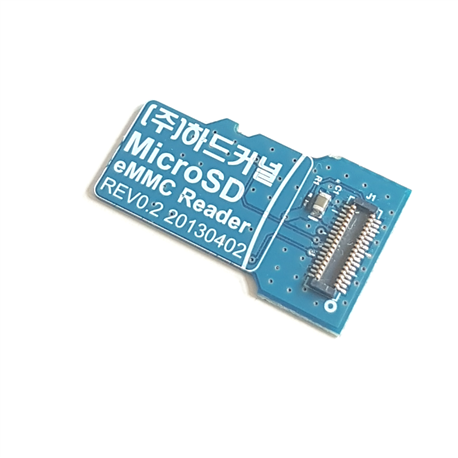
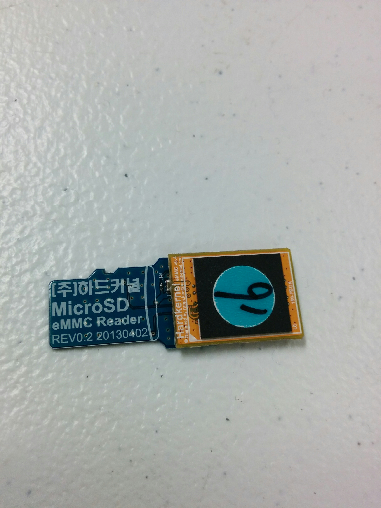
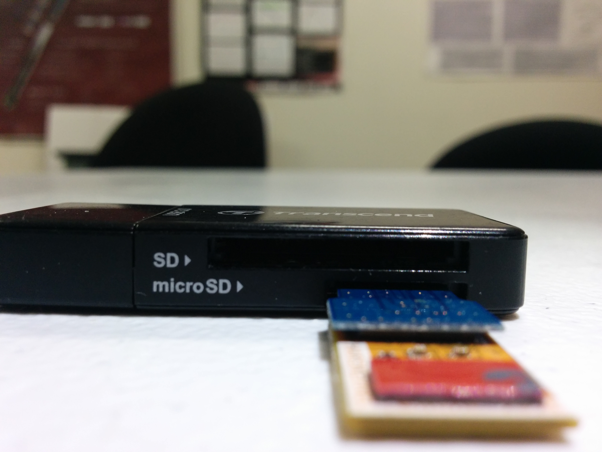
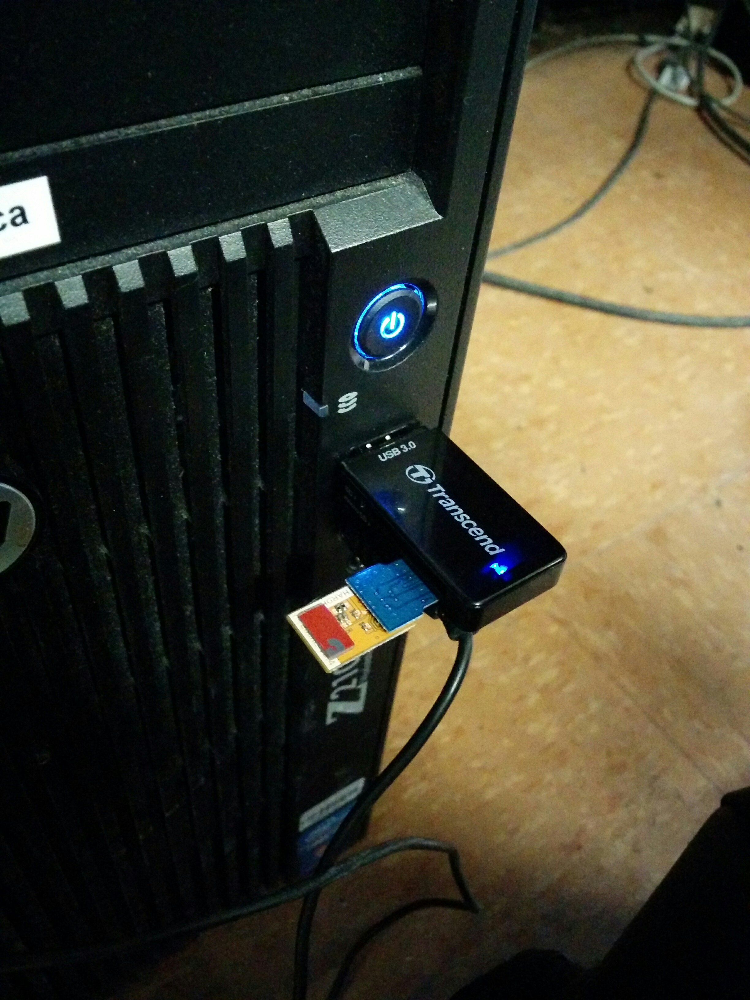

# robotics-prototype
This repo contains the Robotics software team code, as well as some of the other subteams code/documentation.

## Contributing and Development Environment Instructions
Firstly, this project is built in Python 3.3+. You need to have a version of Python installed that is 3.3+. Make sure that whenever you use `python` or `python3` or whatever later on meets this requirement.

Secondly, it is imperative you use a virtual env (instead of your system Python) to use/contribute to the project. 

### Setup [virtualenv](https://docs.python.org/3.6/library/venv.html#module-venvhttps://virtualenv.pypa.io/en/stable/userguide/)
Navigate to the projects root directory (`cd ~/.../robotics-prototype`) and create the virtual environment):
```
$ virtualenv -p <path/to/python3.x> venv
```
Make sure you supply a path to a Python 3.x binary. In my case, I just supplied it like this:
```
$ virtualenv -p `which python3` venv
```
**Note**: Your actual alias for calling Python might be different (e.g. `python`, `py`, `py3`, etc). You can ensure whichever it might be is version 3+ by typing `which python` in Linux/Mac (bash/zsh) or `where py` in Windows (cmd.exe).

You should see a new directory named `venv` inside the root directory. We can now activate this virtual environment:
Linux/Mac (bash/zsh):
```
$ source venv/bin/activate
```
Windows (cmd.exe):
```
C:\> venv\Scripts\activate.bat
```

You should see a `(venv)` appear at the beginning of your terminal prompt (in Linux and Mac at least) indicating that you are working inside the virtualenv. Now when you install something:
```
(venv) $ pip install <package>
```
It will get installed in the `venv`, and not conflict with other projects installed system-wide.

To leave the virtual environment run:
Linux/Mac (bash/zsh):
```
(venv) $ deactivate
```
Windows (cmd.exe):
```
C:\> deactivate.bat
```

### Install [dependencies](https://pip.pypa.io/en/stable/user_guide/#requirements-files)
First, ensure you activated your `venv` and you are in the root project directory. Then, install the required packages:
```
(venv) $ pip install -r requirements.txt -r requirements-dev.txt
```
**Note**: If you want to run the "legacy" GUI (AsimovOperation.py) you'll need to install the `pygobject` module (which is needed for running GTK GUI)
However, this GUI will soon be replaced by a new one using flask, so unless your hellbent on running the old GUI, **feel free to skip the next section** (and keep in mind that the pygobject line in `requirements.txt` is commented out.

#### Install and configure `pygobject3`
If you ran into issues installing `pygobject` when trying to `pip install -r requirements.txt`, then here are possible reasons:

**(A)** You might not have the pyobject installed on your system, in which case you need to install it via your package manager. For MacOS this was as simple as: 
```
(venv) $ brew install pygobject3 gtk+3
```

**(B)** If you get something along the lines of not being able to find `libffi`, you might need to install it via your package manager. For MacOS again: 
```
(venv) $ brew install libffi
```

Confirm its whereabouts with `locate libffi.pc` (you might be prompted  to built the locate database for which the command for doing so is included in the output message). The output you see should be something along the lines of `/usr/local/Cellar/libffi/3.2.1/lib/pkgconfig/libffi.pc` when you type `locate libffi.pc`. For the virtual Python environment to locate it, simply export the environment variable `PKG_CONFIG_PATH` with the directory where `libffi.pc` is located in:
```
export PKG_CONFIG_PATH=/usr/local/Cellar/libffi/3.2.1/lib/pkgconfig
```
Now you should be able to retry installing the requirements:
```
(venv) $ pip install -r requirements.txt
```
Which should produce no errors!

### Setup [setuptools](https://setuptools.readthedocs.io/en/latest/setuptools.html#development-mode)
When you try to run `pytest` from anywhere inside the project, there's a very good chance you'll get `ModuleNotFoundError` thrown. This is because absolute imports inside each test file won't work if the test is being executed by `pytest` inside the test's own directory (i.e. the `sys.path` variable will only contain the directory where the test file lives, not the root directory). To encourage best practices, and avoid doing dirty/hacky `sys.path` manipulation within each python file, using `setuptools`'s **develop** feature will allow the virtual environment to create temporary dev package installs using "hooks" (eggs) to each path inside package directory as defined by the "name" attribute in `setup.py` (i.e. `robot` module will be available as though it was installed through `pip`). 

In other words, this means all imports of modules inside the `robot` directory should be imported with absolute path, e.g. inside `"tests/unit/motor_test.py"`, the `Motor` class can be imported using:
```
# tests/unit/motor_test.py
from robot.basestation.Motor import Motor
...
```

First we have to install `setuptools`, but our `virtualenv` installs this by default when setting up the environment, so no need!

Still in root project directory (which contains `setup.py`):
```
(venv) $ pip install -e .
```

You should now be able to execute tests without `ModuleNotFoundError` thrown:
```
(venv) $ pytest
```

To remove the package you just installed using:
```
(venv) $ pip uninstall robot
```

**DISCLAIMER:** This issue with module imports via `pytest` was the motivating factor to change the project directory structure. For this technique to work, the 'source' code must live inside (nested) a main directory (usually named the same as project directory name or other suitable representative identifier such as **robot** in this case). The `src` subdirectory was renamed because it made no sense when importing a package module by name like `import src.basestation.Motor`, which has no meaning/place in a module semantic context (`import robot.basestation.Motor` is much more appropriate). Most Python projects do not use a `src` directory unless it's for storing their source code that eventually gets compiled to binary (i.e. such as `.c`, `.h`, etc.. files). Also, `base-station` was renamed to `basestation` because Python no-likey dashes in import statements.

### Formatting Guide
When you install the `requirements-dev.txt.` dependencies, you will have `pylint` and `yapf` installed. Both of these packages allow for set guidelines on how code should behave (`pylint`) and how it should look (`yapf`). In other words, `pylint` is the project's linter and `yapf` is the auto-formatter. You can read more about these online but the basic principle is that we should all have code that looks alike and behaves properly based on some established set of heuristics. The `.pylint` file (based entirely on Google's very own one) contains the configurations that `pylint` uses to validate the code. If you configure your IDE properly, both the linter (`pylint`) and autoformatter (`yapf`) should work without prompting any action. Here is an example of the project opened in VSCode (which has it's configurations outlined in `.vscode/settings.json`) showing how `pylint` indicates things (also shown clickable `pytest` actions right inside the source!):


You might not be able to tell from the screenshot, but whenever the incorrect indentation or needless linebreaks are entered, `yapf` automatically formats the code to comply with the project's format rules.

All in all, by using these tools, we will ensure that the codebase is consistent is less of a pain to maintain in the long run or for any new entrants.

Although most of the syntax/format will be handled by `pylint`/`yapf`, some things that aren't are briefly outlined here (namely regarding source file naming guidelines):
- As stated [here](https://github.com/google/styleguide/blob/gh-pages/pyguide.md#3163-file-naming-s3163-file-naming), file names shouldn't include dashes since they need to be importable.
- Although class names use `CapWords`, modules should have `lower_with_under.py` names. This is to prevent confusing with imports on whether or not the module itself or the class was imported as described [here](https://github.com/google/styleguide/blob/gh-pages/pyguide.md#3162-naming-convention). This means even if you file contains only one class like `Motor`, the filename (i.e. module name -- each Python file is considered a module) should be `motor.py` and **not** ~~`Motor.py`~~.
- Test files should be named `modulename_test.py` (note the `_test` appearing as a suffix, not prefix) with the class inside named `TestModuleName` (here `Test` needs to be a prefix, blame `pytest` for that). This class should encapsulate the methods that test various functionality or states named `test_<functionality_or_state>(self)` (same for functions). Note that these guidelines will ensure that your tests will be recognized by [`pytest`'s test discovery](https://docs.pytest.org/en/latest/goodpractices.html#test-discovery). 

#### Atom (tested on ubuntu 16.04, Windows 7)
If you're using atom-editor setting up should be fairly easy.

##### Windows
**NOTE:** It is assumed you have already set up virtualenv along with having installed all the pip dependencies, and the atom text editor itself.

**NOTE:** Because the `.atom/config.cson` works for OSX and Linux, we aren't versioning the Windows equivalent configuration file.
However, if you have issues such as `failed to spawn command pylint` or similar complaining about yapf, you may open the package settings and fix the paths yourself. \
For example, change every `/` to `\`, and change the `venv/bin/whatever` to `venv\Scripts\whatever`.
Make sure to apply these changes in the _atom package settings_, they will automatically take care of your system `config.cson` and take care of details (such as escaping the `\`s in the actual config file).

- Check to see if atom installed properly (this is a [known issue](https://github.com/atom/atom/issues/5869)). Open up `cmd.exe`, run `apm --version`.
If the command fails then check to see if you have a bin folder in your atom install directory (`where atom`).
If `bin` folder is missing, try [deleting your `%LOCALAPPDATA%\Temp` folder and reinstalling Atom](https://discuss.atom.io/t/atom-installation-error-on-windows-8-1/15050/11), that worked for me.
- If `bin` folder is *not* missing, and `apm --version` returns something along the lines of `command not found`, make sure to [add the path to your bin for atom to your path](https://www.java.com/en/download/help/path.xml).
- Run `pylint --version`. If it fails with `RuntimeError: Inconsistent hierarchy` then go to the last python file in the stack trace (for me it was `functools.py`) and change `if not candidate` to `if candidate == None`.
See the issue and its discussion [here](https://github.com/PyCQA/pylint/issues/1388) on github.
- If you've made it past the last two steps, proceed to run the commands listed under **Ubuntu** section underneath.

##### Ubuntu
- Run `apm install --packages-file .atom/package-list.txt` (from project root). This should install all needed packages.
- Note that the config file `./atom/config.cson` is where the configurations for said packages are stored/versioned for this project.

## ODROID
### Flashing ubuntuMATE to the odroid (tested on Ubuntu 16.04)

Sometimes things go wrong, like when all of a sudden the odroid won't properly boot up anymore.
The simplest fix for this usually is reflashing the OS onto your memory card.
When doing this, you are overwriting all previous data on the memory card so if you want to retain and are able to access your user space data then back it up prior to proceeding.
If you wanted to back up your Documents folder then use `sudo cp -rp /home/odroid/Documents /media/backup/my_home` with the `-rp` flag if you want to keep owners and permissions of the files intact.
For storage media types you are either using a microSD or an eMMC card. The method described below will work for both (so far only tested on eMMC) but you should know that you will need some kind of adapter to be able to access the memory cards as storage devices.

#### microSD
For the microSD card your typicial microSD to SD reader will do. If you don't have a microSD port on your computer you can use a microSD to USB adapter.

#### eMMC
For the case of the eMMC card you will need to use an eMMC reader, along with a microSD to SD or USB adapter.[This forum post](https://forum.odroid.com/viewtopic.php?f=53&t=2725) contains a list of verified eMMC readers, microSD/USB adapters.

In my case I used the following eMMC reader to microSD, paired with a Transcend USB adapter.

1. eMMC module reader



2. eMMC module mounted onto reader



3. eMMC module reader mounted onto USB adapter microSD slot



4. Plugged in



The next step is to download the ubuntuMATE 16.04 image from [here](https://odroid.in/ubuntu_16.04lts/). Choose the proper image depending on the type of odroid you have.
For the odroid we are using in competition (xu4) I used `ubuntu-16.04.2-mate-odroid-xu4-20170510.img.xz`.

If it is not already installed, you will need to install `xz-utils` via `sudo apt-get install xz-utils`.

Now decompress the compressed image with: `unxz ubuntu-16.04.2-mate-odroid-xu4-20170510.img.xz` to obtain the img file.

Use the command `lsblk` to identify the block device that is the eMMC/microSD card you are trying to flash.
To be sure, unplug your adapter first and run `lsblk`, then plug in the adapter and run `lsblk` to see the difference.
In my case it was `/dev/sdb`.

Finally, to flash the image onto the card, you can use the `ddrescue` unix library.

To install it run `sudo apt-get install ddrescue`.

To flash it run `sudo ddrescue -D --force ubuntu-16.04.2-mate-odroid-xu4-20170510.img.xz /dev/sdb`, making sure to replace `/dev/sdb` with your own proper value.

By the time it is done, you will have a fresh install of ubuntuMATE on your card.
**Note** that when booting up for the very first time after a flash the odroid will boot to login screen, but then suddenly die.
This is normal,  after the initial bootup you will need to reboot one more time for it to finally work properly.

Note that the first time you connect your odroid to the internet it will most likely automatically start the job `apt-daily.service` which will temporarily make the `apt-get` command unavailable.
To confirm this, you can check with `ps aux | grep apt` to get the process id (pid). This process will lock the use of `apt-get`.
The best thing to do is to just wait until it is done. You can see how long it has been running with `ps -o etime= -p process_id` (replacing "processid" with the corresponding pid of the apt daily update process.
To get a running time of elapsed time updated each second you may run `watch -n 1 ps -o etime= -p process_id`.

### Custom images

These custom images are made by directly setting up the changes on a fresh image, then using `dd` to save the state of the operating system as an image file.

Example: `sudo dd if=/dev/sdb of=ubuntuMateDev.img bs=4M`

For step by step instructions see [here](http://odroid.us/mediawiki/index.php?title=Create_SD_Card_Images).

#### Dev

The ubuntuMATE dev-0 image is customized as follows to allow us to more easily develop on the odroid.

Differences between default ubuntuMATE image:
- [Autologin enabled](https://ubuntu-mate.community/t/auto-login-to-the-desktop/60)
- Install `curl` and `git` with `apt-get`
- Clone this `robotics-prototype` repo to `~/Programming` folder
- Install `nvm v0.33.11`, `node v10.13.0` (LTS) by `wget -qO- https://raw.githubusercontent.com/creationix/nvm/v0.33.11/install.sh | bash` , and `nvm install node v10.13.0`, respectively
- Setup systemd service called `ip-emailer` to run `runEmailer.sh` ([how to setup a startup service with systemd](https://gist.github.com/pdp7/d4770a6ba17e666848796bf5cfd0caee))
- Add configuration files `.bash_aliases` and `.nanorc`

Any kind of authentication requiring services (such as a connection to a wifi network requiring username/password) will not be included in the images.
To find all the custom images follow [this link](https://drive.google.com/drive/u/1/folders/17An9xUkBo8dGS8PoY54tsNWucJLyBDJC) to the corresponding google drive folder.

For further details on these images see the [Custom Odroid Images wiki page](https://github.com/space-concordia-robotics/robotics-prototype/wiki/Custom-Odroid-Images).

### How to upload Arduino scripts from the odroid

1. Make sure the arduino is plugged into the odroid

2. Copy your Arduino source(s) into platformio/src/

3. Navigate to platformio/ folder

4. Upload the script via the following command: `platformio run -t upload`. This will both compile and upload the code.

Note: I didn't look into adding libraries yet but I'm pretty sure you want to place them in the platformio/lib folder. See [platformio lib help page](http://docs.platformio.org/en/latest/userguide/lib/index.html) to learn more

### Systemd services

[This link](https://gist.github.com/pdp7/d4770a6ba17e666848796bf5cfd0caee) explains how to setup a systemd service in steps.

The systemd service files are versioned under `robot/rover/systemd`.

#### Ethernet config service

The odroid has two ethernet network types:

- `WiredConnection1` for when it is being connected to a regular router
- `RoverOBC` for when it is being connected to the RocketM900 radio

On bootup, if an ethernet cable is plugged in, the config script will switch to `WiredConnection1` and attemp to ping google server as a test.
If the test fails, the `RoverOBC` connection type is selected.

This was accomplished by running `syncConfigEthernet.sh` and setting up a systemd startup service to run `runEthernetConfig`.

#### IP emailer service

The odroid will send an email with its local IP address every time it boots, after having run the ethernet config service.

This was accomplished by running `syncEmailer.sh` and setting up a systemd startup service to run `runEmailer`.

Let Peter know if you want to be added to this mailing list.

#### Ros Rover Startup service

This service launches a roslaunch file `rover.launch` which will allow developers to easily add nodes to be launched on startup without having to create
a new systemd service each time. It automatically starts the rosmaster server. It runs after the IP emailer service.

This was accomplished by running `syncRosRoverSync.sh` and setting up a systemd startup service to run `runRosRoverStart.sh`.

### Remote connect from home

**NOTE:** This will only work if the odroid is powered up and connected to the internet at Concordia.

- Open a terminal (git bash is recommended if you're using windows)
- SSH into Concordia's network with your netname (type the following into the terminal):
```
ssh net_name@login.encs.concordia.ca
```
- It should ask you for a password, which will your ENCS password
- Grab the latest IP address of the odroid from your email, then ssh into it:
```
ssh odroid@ip_address
```
- It should ask you for a password, which will be `odroid`

